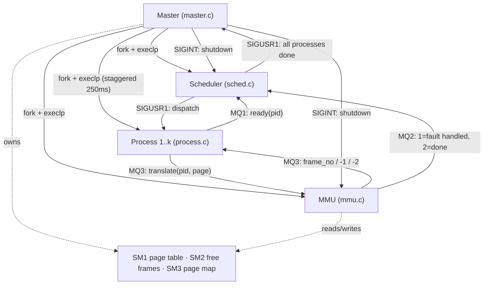
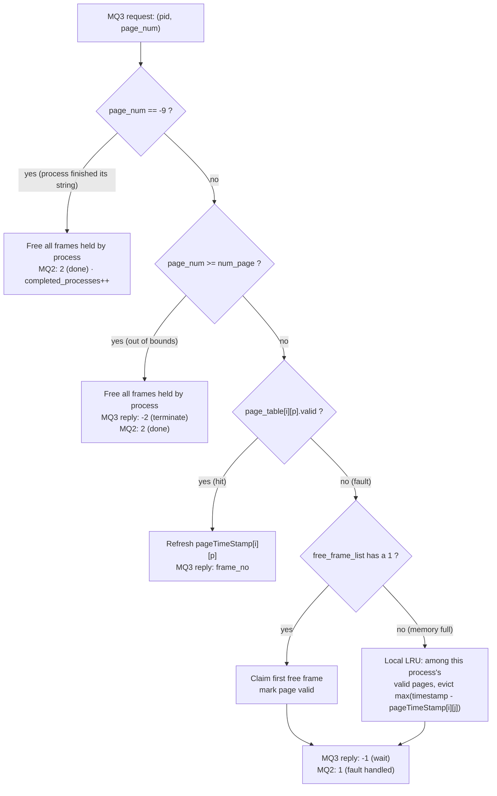
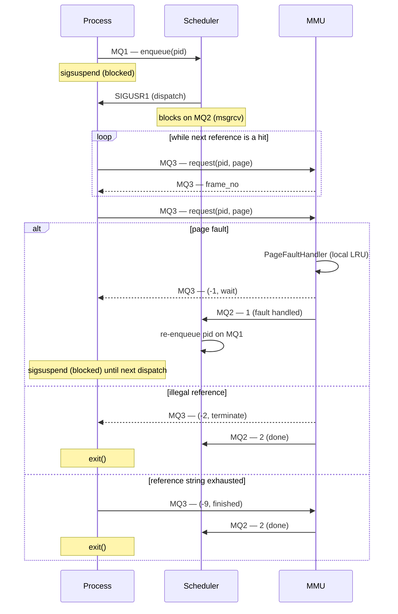

# Virtual Memory Simulator


A multi-process operating-systems simulation, written in C, of **pure demand paging** with a **local Least Recently Used (LRU)** page-replacement policy. Four cooperating processes — a Master, a Scheduler, an MMU, and a pool of simulated user Processes — are wired together with System V **shared memory** and **message queues**, and coordinated with **POSIX signals** instead of busy-waiting.

---

## How it fits together

| Module               | File         | Role                                                                                                                          |
| :------------------- | :----------- | :----------------------------------------------------------------------------------------------------------------------------- |
| **Master**            | `master.c`   | Reads simulation parameters, creates all shared memory/message queue IPC objects, pre-allocates frames, `fork()`+`execlp()`s the other three module types, then waits for the Scheduler to finish before tearing everything down. |
| **Scheduler**         | `sched.c`    | A FCFS dispatcher. Pulls the next ready PID off the ready queue, wakes it with `SIGUSR1`, then blocks for the MMU's verdict before deciding whether to re-queue or count the process as finished. |
| **MMU**               | `mmu.c`      | Owns the page table and free-frame list. Services translation requests, resolves page faults with local LRU, detects out-of-bounds ("illegal") accesses, and logs every event to `result.txt`. |
| **Process**           | `process.c`  | Simulates one user program. Walks a comma-separated reference string of virtual pages handed to it by the Master, requesting each one from the MMU and sleeping between dispatches. |

Each Process and the Scheduler/MMU are separate binaries, spawned with `fork()` and replaced via `execlp()` — the Master never contains their logic itself, only the orchestration.



### Startup sequence

1. Master prompts for `k` (number of processes), `m` (max virtual pages per process), and `f` (total physical frames).
2. Master creates 3 shared-memory segments (page table, free-frame list, per-process page-count map) and 3 message queues (ready queue, MMU→Scheduler, Process↔MMU), and zero-initializes them.
3. Master forks+execs the Scheduler and the MMU, passing IPC ids as command-line arguments.
4. Master randomly assigns each process a virtual address-space size (1..m pages) and pre-allocates it a proportional share of the physical frames up front (with a fallback to guarantee at least one frame each) — this is done so processes don't all fault immediately on their first access.
5. For each process, Master generates a random reference string of page numbers (length scaled to its address space), with a **5% chance per reference** of deliberately generating an out-of-range page number to exercise the illegal-access path. It then forks+execs the Process binary with that string and staggers spawns by 250ms.
6. Master blocks (via `sigsuspend`) until the Scheduler signals that every process has terminated, then sends `SIGINT` to the Scheduler and MMU, detaches and destroys all shared memory and message queues, and exits.

---

## Page-fault handling and LRU

The MMU keeps a global logical clock (`timestamp`, incremented once per serviced request) and a per-process, per-page "last accessed" timestamp table. On each translation request for page `p` of process `i`:

- **Hit** — `page_table[i][p].valid == 1`: the timestamp is refreshed and the frame number is returned immediately, no fault.
- **Out of bounds** — `p >= page_map[i].num_page`: treated as an illegal reference. The MMU frees every frame the process holds, tells the process to terminate (`-2`), and reports it to the Scheduler as done.
- **Fault, free frame available**: the first free frame found in the free-frame list is claimed for the page — no eviction needed.
- **Fault, memory full**: the MMU scans only the *faulting process's own* resident pages (this is what makes the LRU **local** rather than global) and evicts whichever one has the largest `timestamp - pageTimeStamp[i][j]`, i.e. the one least recently touched, freeing its frame for the new page.

After a fault the process is told to pause (`-1`) and the Scheduler re-queues it once the MMU signals the fault is resolved; on a hit the process moves straight to its next reference without going back through the Scheduler.



This mirrors `PageFaultHandler()` and the main `while (completed_processes < k)` loop in `mmu.c` exactly — free-frame allocation is always tried before any eviction, and eviction only ever looks at frames belonging to the *same* process (`p_i`), which is what makes the algorithm local rather than global LRU.

### One dispatch, in order

A single `SIGUSR1` dispatch from the Scheduler can cover several page *hits* in a row — the Process only talks to the Scheduler again once it either faults or runs out of references, since hits never touch MQ2.



---

## Synchronization: signal-safe waiting, not `pause()`

Coordination between the Scheduler and the waiting Processes/Master is done with `SIGUSR1`, but naively doing `if (flag == 0) pause();` has a lost-wakeup race: if the signal arrives in the gap between checking `flag` and calling `pause()`, the wakeup is lost and the process blocks forever.

This implementation closes that gap in `master.c` and `process.c` by:
1. Explicitly resetting any inherited signal mask right after `execlp()` (masks survive `exec`, so a blocked signal in the Master could otherwise silently propagate to a child that assumes it's unblocked).
2. Blocking `SIGUSR1` with `sigprocmask(SIG_BLOCK, ...)` before checking the flag.
3. Waiting with `sigsuspend()` instead of `pause()`, which atomically unblocks the signal and sleeps in one step — so a signal delivered right up to the last instant is still observed.

`master.c` additionally defers blocking `SIGUSR1` until *after* all children have been `fork()`ed, since `fork()` copies the parent's signal mask — blocking it any earlier would leak into every child and break their own `sigsuspend()` waits.

The MMU and Scheduler, by contrast, end their lives with a plain `pause()`, since by that point they're only waiting to be torn down by an unconditional `SIGINT` from the Master (no flag, no race to avoid).

---

## IPC objects

| Object                                  | Created by | Carries |
| :--------------------------------------- | :--------- | :------ |
| **SM1** – Page table (`shmget`)          | Master     | `pageTable[k*m]`: `{valid, frame_no}` per (process, virtual page). |
| **SM2** – Free-frame list (`shmget`)     | Master     | `int[f]`, 1 = free, 0 = in use. |
| **SM3** – Process/page map (`shmget`)    | Master     | `pageMap[k]`: `{pid, num_page}`, lets the MMU/Scheduler resolve a PID back to its process index and address-space size. |
| **MQ1** – Ready queue (`msgget`)         | Master     | Process → Scheduler: "I'm ready to run" (PID). |
| **MQ2** – MMU status channel (`msgget`)  | Master     | MMU → Scheduler: `1` = fault handled (re-queue), `2` = process done/killed. |
| **MQ3** – Translation channel (`msgget`) | Master     | Process ↔ MMU: page requests, and frame number / `-1` (fault, wait) / `-2` (illegal, terminate) responses, keyed by PID as `m_type`. |
| **SIGUSR1**                               | —          | Scheduler → Process/Master: dispatch / all-done wakeup (see above). |
| **SIGINT**                                | —          | Master → Scheduler, MMU: unconditional shutdown once the run is over. |

All shared memory and message queues are destroyed (`shmctl`/`msgctl` with `IPC_RMID`) by the Master during shutdown, so a normal run leaves nothing behind in the kernel's IPC tables. (A run killed abruptly, e.g. `kill -9` on the Master, will leak these — check with `ipcs` and clean up with `ipcrm` if that happens.)

---

## Building and running

### Prerequisites
- Linux or WSL (uses System V IPC and POSIX signals — no Windows-native build path).
- `gcc` and `make`.

### Build
```bash
make
```

### Run
```bash
./master
```
You'll be prompted for the scale of the run:
```text
Enter the total number of processes: 5
Enter Virtual address space (Max pages per process): 10
Enter physical address space (Total frames): 20
```
Master, Scheduler, and MMU log progress to stdout as they run; the MMU additionally writes a structured event log — global reference ordering, page faults, invalid references, and final per-process fault/error counts — to `result.txt` in the working directory.

`result.txt` is opened with `O_TRUNC` (`mmu.c`), so **every run overwrites it completely** — it's a snapshot of the most recent run only, not an append-only log. A [`result.txt`](result.txt) from a real 4-process/8-page/5-frame run is committed to this repo as a worked example of the output format (hits, a fault-driven eviction under memory pressure, a clean completion, and two illegal-reference terminations all show up in it); running `./master` yourself will replace it locally with your own run.

### Clean
```bash
make clean
```
Removes the built binaries and `result.txt`.

---

## Design notes worth knowing

- Argument buffers (reference strings, numeric args passed via `execlp`) use a fixed `STR_SIZE` of 5000 chars; a very large `k`/`m` combination could in principle overflow this.
- "Illegal access" handling is a manual bounds check in the MMU (`page_num >= num_page`), not an actual trapped `SIGSEGV` — it emulates the *consequence* of an out-of-bounds access, not the hardware mechanism.
- Shared memory is accessed without locks, but this is safe here only because the MMU is the single serializing consumer of all page-table/free-frame-list writes (one process, one message queue, one request at a time) — it is not a general-purpose concurrency-safe design.
